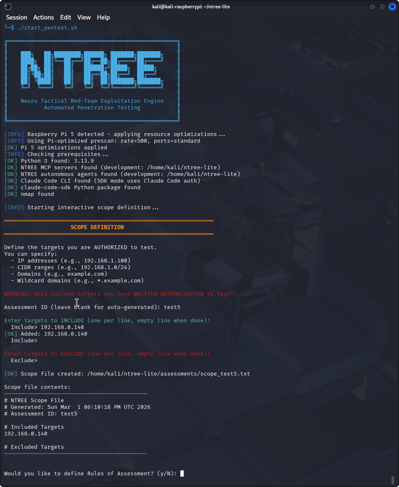
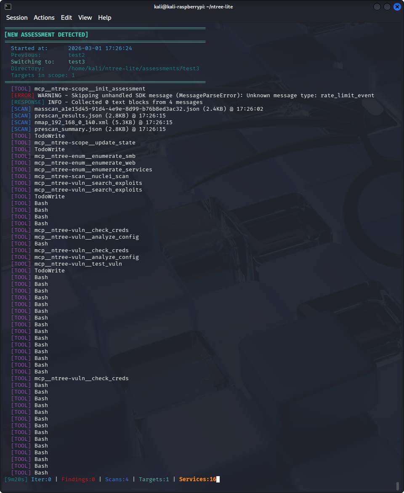
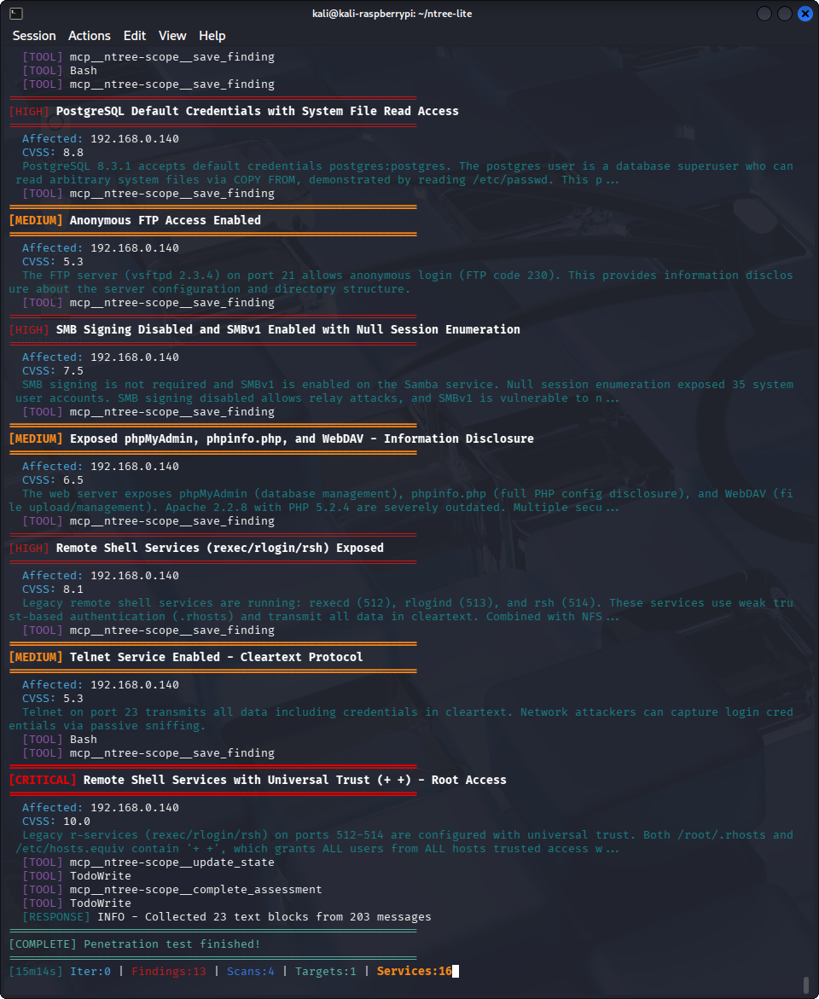
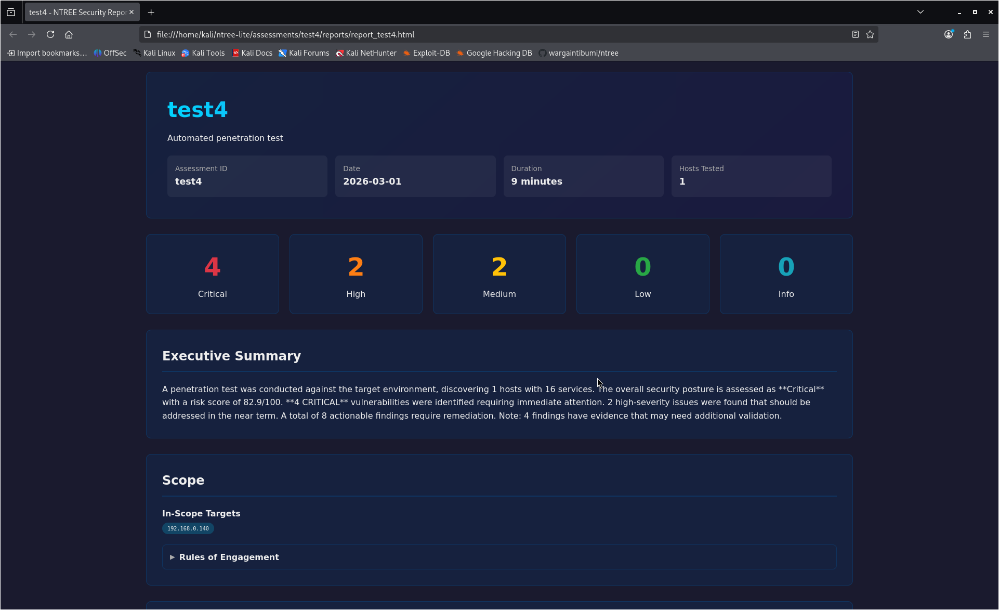
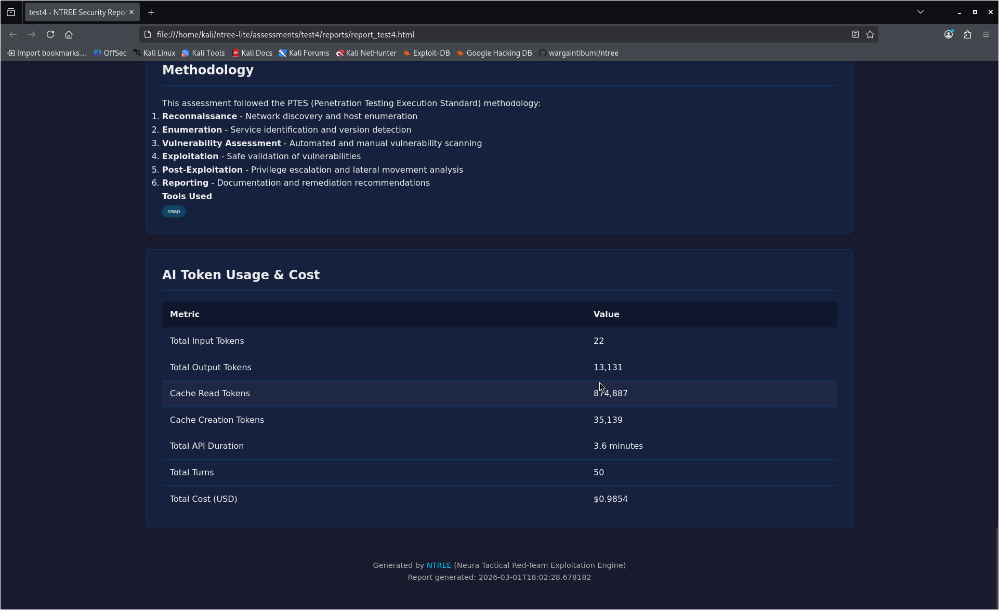

# NTREE - Neura Tactical Red-Team Exploitation Engine

**Open Source Edition**

An autonomous penetration testing platform powered by [Claude Code SDK](https://docs.anthropic.com/en/docs/claude-code), integrating AI with security tools via the [Model Context Protocol (MCP)](https://modelcontextprotocol.io/). Built with security guardrails at every layer — not just prompt instructions, but code-enforced boundaries. Runs on Raspberry Pi 5 or Kali Linux ARM64.



## Why NTREE?

Most AI pentesting tools give an LLM a shell and hope for the best. NTREE takes a different approach: the AI never runs raw commands directly. Every action flows through **typed MCP tools** with input validation, scope enforcement, and audit logging — giving you autonomous pentesting with accountability.

### Safety by Design

```
Scope File + RoE ──> Claude Code SDK ──> MCP Tools ──> Scope Validation ──> Target
       │                    │                 │               │
       │                    │                 │               └─ verify_scope() on
       │                    │                 │                  every action
       │                    │                 │
       │                    │                 └─ Typed inputs (Pydantic),
       │                    │                    safe command execution,
       │                    │                    interactive tool detection
       │                    │
       │                    └─ Token tracking, cost transparency,
       │                       full audit trail (JSONL)
       │
       └─ Machine-readable rules: ALLOW_EXPLOITATION,
          REQUIRES_APPROVAL, scope boundaries
```

**MCP-based tool isolation** — Claude operates exclusively through 5 MCP servers with Pydantic-validated inputs. No direct shell access. Every command goes through `command_runner.py` with timeouts, stdin blocking, and interactive tool detection.

**Rules of Engagement compliance** — RoE files are parsed into machine-readable flags (`ALLOW_EXPLOITATION: true`, `REQUIRES_APPROVAL`, `DO_NOT_TEST`) that influence tool behavior and evidence quality scoring. The AI operates within defined boundaries, not just suggested ones.

**Scope enforcement** — Every target is validated against the authorized scope via `verify_scope()` before any tool executes. Defense in depth at the code level, not just the prompt level.

**Token usage and cost transparency** — Input/output tokens, cache utilization, API duration, and USD cost are tracked per assessment and rendered directly in the final HTML report. Full visibility into what the AI consumed.

**Evidence quality validation** — Findings are automatically scored (excellent, good, acceptable, weak, insufficient) to distinguish real exploitation proof from scan output. RoE-aware — adjusts expectations when exploitation isn't permitted.

**Complete audit trail** — Every tool call, shell command, finding, and AI interaction is logged to JSONL with timestamps and sequence numbers. Forensic-grade trail for compliance review.

## NTREE vs Kali MCP Server

Kali Linux introduced [mcp-kali-server](https://www.kali.org/tools/mcp-kali-server/), a command execution bridge that lets Claude run terminal commands on a Kali box. Community projects like [kali-mcp](https://github.com/k3nn3dy-ai/kali-mcp) extend this with Docker isolation and 35+ tool wrappers. While useful for ad-hoc execution, they take a fundamentally different approach to security.

**Kali MCP = "Give the AI access to security tools"**
**NTREE MCP = "A pentesting framework where the AI operates within enforced boundaries"**

| Capability | Kali MCP Server | NTREE |
|---|---|---|
| **Architecture** | Generic command bridge — AI sends shell commands | Purpose-built MCP servers with typed, validated tool interfaces |
| **Scope enforcement** | None — will attack anything Claude decides | `verify_scope()` on every action, code-enforced boundaries |
| **RoE compliance** | None | Machine-readable flags (`ALLOW_EXPLOITATION`, `REQUIRES_APPROVAL`) enforced at tool level |
| **Assessment lifecycle** | Stateless | Full phase tracking (INIT→RECON→ENUM→VULN→REPORT→COMPLETE) |
| **Finding management** | Findings exist only in Claude's context window | `save_finding()` → persistent JSON → report generation |
| **Report generation** | None | Professional HTML reports with RoE summary and token usage |
| **Evidence validation** | None | Quality scoring (excellent→insufficient), RoE-aware thresholds |
| **Audit logging** | Session command history | Full JSONL audit trail with timestamps and data sanitization |
| **Token/cost tracking** | None | Per-assessment input/output/cache tokens with USD cost in reports |
| **Prescan pipeline** | None | masscan→nmap pipeline with service/OS annotations |
| **Checkpoint/resume** | None | Resume interrupted assessments with full state recovery |
| **Interactive tool detection** | None — commands can hang indefinitely | Auto-detection, stdin blocking, alternatives suggested |
| **Live monitoring** | None | Real-time progress viewer (ntree_monitor.py) |

### Why This Matters

As [security researchers have noted](https://www.penligent.ai/hackinglabs/kali-linux-claude-via-mcp-is-cool-but-its-the-wrong-default-for-real-pentesting-teams/), giving an LLM a shell on an offensive security box creates real risks: no execution boundaries, no reproducibility, no auditability, and an expanded prompt injection surface from raw tool output. NTREE addresses each of these — scope validation prevents unauthorized targeting, the phase-based lifecycle creates reproducible workflows, JSONL audit logging captures every decision, and typed MCP interfaces reduce the attack surface compared to raw shell access.

## Features

- **Autonomous pentesting** — Fully automated from scope to report via Claude Code SDK
- **5 MCP servers** — Scope validation, scanning, enumeration, vulnerability testing, reporting
- **Professional HTML reports** — Findings, evidence, RoE summary, token usage, and remediation
- **Prescan pipeline** — Fast host discovery with masscan + detailed nmap fingerprinting
- **Session resume** — Pick up interrupted assessments where you left off

## Quick Start

### 1. Install

```bash
git clone https://github.com/YOUR_USERNAME/ntree.git
cd ntree
bash setup.sh --yes
```

### 2. Create a scope file

```
# targets.txt
192.168.1.0/24
EXCLUDE 192.168.1.1
```

### 3. Run a pentest

```bash
./start_pentest.sh --scope targets.txt
```

Or use interactively with Claude Code:

```bash
claude
# Then: "Start NTREE with scope: ~/ntree/templates/scope_ctf_lab.txt"
```

## MCP Servers

| Server | Purpose | Key Tools |
|--------|---------|-----------|
| **ntree-scope** | Assessment lifecycle | `init_assessment`, `verify_scope`, `save_finding`, `update_state`, `complete_assessment` |
| **ntree-scan** | Network discovery | `scan_network`, `quick_scan`, `passive_recon` |
| **ntree-enum** | Service enumeration | `enumerate_services`, `search_wordlists`, `web_crawl` |
| **ntree-vuln** | Vulnerability testing | `test_vulnerability`, `check_credentials`, `research_exploits` |
| **ntree-report** | Report generation | `score_risk`, `generate_report` |

## Prescan

Discover live hosts before the full assessment:

```bash
python ntree-autonomous/prescan.py --scope targets.txt              # Standard
python ntree-autonomous/prescan.py --scope targets.txt --ports quick # Fast
python ntree-autonomous/prescan.py --scope targets.txt --ports full  # Thorough
```

## Monitoring

Watch a pentest in real-time from another terminal:

```bash
./ntree_monitor.py                    # Auto-detect active assessment
./ntree_monitor.py --findings-only    # Only show new findings
```





## Session Resume

```bash
./start_pentest.sh --list-sessions    # See resumable sessions
./start_pentest.sh --resume           # Interactive selection
./start_pentest.sh --resume name      # Resume specific assessment
```

## Rules of Engagement

Control what the AI is allowed to do with RoE template files:

```bash
# Use a built-in template
./start_pentest.sh --scope targets.txt --roe ctf_lab

# Or specify a custom file
./start_pentest.sh --scope targets.txt --roe ~/my_roe.txt
```

Templates included: `roe_example.txt`, `roe_ctf_lab.txt`, `roe_internal_network.txt`, `roe_external_webapp.txt`

RoE flags like `ALLOW_EXPLOITATION`, `ALLOW_CREDENTIAL_TESTING`, and `REQUIRES_APPROVAL` are enforced at the tool level and reflected in the final report with color-coded badges.

### RoE in Action — Real Pentest Comparison

The [`examples/`](examples/) directory contains results from two real pentests against the same Metasploitable 2 VM — same target, same MCP tools, **different RoE templates**:

| | CTF Lab RoE | Internal Network RoE |
|---|---|---|
| **Findings** | 8 | 14 |
| **Turns** | 50 | 66 |
| **Cost** | $0.99 | $1.32 |
| **Agent behavior** | Exploitation-focused — get root, move on | Audit-focused — document every risk |
| **Unique findings** | _(none)_ | Telnet cleartext, R-services, SSH weak ciphers, SMB null sessions |

The CTF RoE (`SCAN_INTENSITY: aggressive`, `RATE_LIMITING: disabled`, `REQUIRES_APPROVAL: none`) made the agent hunt for quick wins. The Internal Network RoE (`MAX_LOGIN_ATTEMPTS: 3`, `REQUIRES_APPROVAL: exploitation`, `PROHIBITED: data exfiltration`) made it spend more time on enumeration and document configuration weaknesses that matter in corporate environments.

**RoE doesn't just restrict — it shapes strategy.** See [`examples/README.md`](examples/README.md) for the full breakdown.

### Generated Reports

NTREE produces professional HTML reports with severity dashboards, executive summaries, RoE compliance badges, and full token usage transparency.





## Scope File Syntax

```
192.168.1.100        # Single IP
192.168.1.0/24       # CIDR range
example.com          # Domain
*.example.com        # Wildcard subdomains
EXCLUDE 192.168.1.1  # Exclusion
```

## Requirements

- Python 3.10+
- Kali Linux or Raspberry Pi OS (ARM64)
- Claude Code CLI (`claude`)
- Security tools: nmap, masscan, nuclei, nikto, gobuster, hydra, etc.

## Development

```bash
cd ntree-mcp-servers
source venv/bin/activate
pip install -e ".[dev]"

# Run tests
pytest tests/ -v

# Lint
black ntree_mcp/
ruff check ntree_mcp/
```

## Contributing

1. Fork the repository
2. Create a feature branch
3. Make your changes
4. Run tests: `pytest tests/ -v`
5. Submit a pull request

## License

MIT License - see [LICENSE](LICENSE) for details.

## Acknowledgments

- [SecLists](https://github.com/danielmiessler/SecLists) by Daniel Miessler
- [MCP Protocol](https://modelcontextprotocol.io/) by Anthropic
- [Claude Code](https://claude.ai/code) by Anthropic
